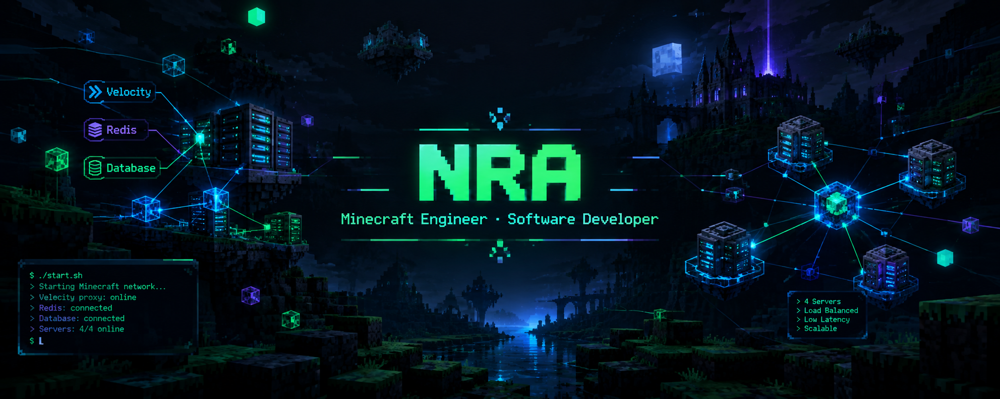

<div align="center">



<br>


<br><br>

<a href="https://github.com/NRAXOO"></a>
&nbsp;

&nbsp;
<a href="mailto:jaimemarquin@gmail.com"></a>

<br>

<!-- Website (futuro): <a href="https://TU_WEBSITE.com"><b>Portfolio</b></a> -->
<b>Portfolio · Próximamente</b>

<br><br>


</div>

<br>

---

<div align="center">

# Nra

### Software Developer · Minecraft Engineer · Full Stack · Mobile


</div>

<br>

```console
dev@minecraft:~$ whoami
Nra

dev@minecraft:~$ cat focus.txt
especialidad  : Minecraft (plugins, mods y clientes personalizados)
complemento   : Web, Full Stack, Backend, Mobile, bases de datos, infraestructura
enfoque       : arquitectura limpia, rendimiento y sistemas mantenibles
```

Soy desarrollador de software y mi especialización principal es el ecosistema de Minecraft: plugins para servidores, mods, clientes personalizados y la infraestructura de red que los conecta. Me interesa tanto la parte visible (interfaces, mecánicas, experiencia de juego) como lo que ocurre por debajo: paquetes, concurrencia, persistencia y comunicación entre servidores.

Fuera de Minecraft trabajo en desarrollo Web y Full Stack, Backend, aplicaciones Android, bases de datos e infraestructura. Esa base general me permite construir un sistema completo: desde la interfaz y la API hasta la base de datos y el despliegue.

<br>

<div align="center">

### SOBRE MÍ

</div>

```text
[>] Aprendiendo                 TU_TEMA_DE_APRENDIZAJE
[>] Abierto a colaborar en      proyectos open source de Minecraft y herramientas para desarrolladores
[>] Puedes preguntarme sobre    arquitectura de plugins, redes con Velocity, Redis, desarrollo Full Stack
[>] Dato curioso                Me sé 345 dígitos de pi
```

<br>

---

<div align="center">

## 01 · ÁREAS DE ESPECIALIZACIÓN

</div>

<table>
  <tr>
    <td width="50%" valign="top">
      <h3>MINECRAFT</h3>
      <sub>Especialización principal</sub>
      <ul>
        <li>Plugins</li>
        <li>Mods</li>
        <li>Custom Clients</li>
        <li>Server Systems</li>
        <li>Networking</li>
        <li>Performance</li>
        <li>NMS</li>
        <li>ProtocolLib</li>
        <li>Adventure API</li>
        <li>Feather Toolkit</li>
      </ul>
    </td>
    <td width="50%" valign="top">
      <h3>WEB / FULL STACK</h3>
      <sub>Interfaz, API y persistencia</sub>
      <ul>
        <li>HTML</li>
        <li>CSS</li>
        <li>JavaScript</li>
        <li>TypeScript</li>
        <li>React</li>
        <li>Next.js</li>
        <li>Node.js</li>
        <li>Express</li>
        <li>REST APIs</li>
        <li>WebSockets</li>
        <li>Authentication</li>
      </ul>
    </td>
  </tr>
  <tr>
    <td width="50%" valign="top">
      <h3>MOBILE</h3>
      <sub>Android nativo</sub>
      <ul>
        <li>Android Studio</li>
        <li>Kotlin</li>
        <li>Java</li>
        <li>Android SDK</li>
        <li>Material Design</li>
        <li>REST APIs</li>
        <li>Local Storage</li>
      </ul>
    </td>
    <td width="50%" valign="top">
      <h3>SYSTEMS / BACKEND</h3>
      <sub>Servicios, datos y bajo nivel</sub>
      <ul>
        <li>APIs</li>
        <li>Databases</li>
        <li>Networking</li>
        <li>Distributed Systems</li>
        <li>C++</li>
        <li>Rust</li>
        <li>Python</li>
        <li>Infrastructure</li>
      </ul>
    </td>
  </tr>
</table>

<br>

---

<div align="center">

## 02 · MINECRAFT DEVELOPMENT

</div>

Minecraft es el eje de mi trabajo. Lo abordo en tres frentes que se complementan: el servidor (plugins), el juego (mods) y el cliente (clientes personalizados).

<br>

### Plugin Development

Desarrollo de plugins para servidores, desde sistemas de gameplay hasta infraestructura interna de una red.

<table>
  <tr>
    <td width="33%" valign="top">
      <b>Plataformas y APIs</b>
      <ul>
        <li>Paper</li>
        <li>Spigot</li>
        <li>Velocity</li>
        <li>Adventure API</li>
        <li>Feather Toolkit</li>
        <li>NMS</li>
        <li>ProtocolLib</li>
        <li>Packets</li>
      </ul>
    </td>
    <td width="33%" valign="top">
      <b>Sistemas de servidor</b>
      <ul>
        <li>Commands</li>
        <li>Events</li>
        <li>GUIs</li>
        <li>Permissions</li>
        <li>Economy</li>
        <li>Player Data</li>
        <li>Scheduling</li>
      </ul>
    </td>
    <td width="33%" valign="top">
      <b>Integración y datos</b>
      <ul>
        <li>Configuration</li>
        <li>Database integrations</li>
        <li>API integrations</li>
      </ul>
    </td>
  </tr>
</table>

<br>

### Mod Development

Modificación del juego a nivel de código, tanto del lado del cliente como del servidor.

<table>
  <tr>
    <td width="50%" valign="top">
      <b>Loaders y herramientas</b>
      <ul>
        <li>Fabric</li>
        <li>Forge</li>
        <li>NeoForge</li>
        <li>Mixins</li>
      </ul>
    </td>
    <td width="50%" valign="top">
      <b>Áreas de trabajo</b>
      <ul>
        <li>Client-side systems</li>
        <li>Server-side systems</li>
        <li>Networking</li>
        <li>Rendering</li>
        <li>Custom mechanics</li>
      </ul>
    </td>
  </tr>
</table>

<br>

### Custom Client Development

Clientes personalizados donde la experiencia de usuario, el rendimiento y la integración con el servidor se diseñan en conjunto.

<table>
  <tr>
    <td width="50%" valign="top">
      <ul>
        <li>Clientes personalizados</li>
        <li>Custom UI</li>
        <li>Rendering</li>
        <li>Modules</li>
      </ul>
    </td>
    <td width="50%" valign="top">
      <ul>
        <li>Networking y Packets</li>
        <li>Performance</li>
        <li>Server integration</li>
        <li>Client-side systems</li>
      </ul>
    </td>
  </tr>
</table>

<br>

---

<div align="center">

## 03 · ARQUITECTURA DE PLUGINS

</div>

No me limito a implementar funcionalidades: diseño sistemas pensando en escalabilidad, mantenimiento, separación de responsabilidades y rendimiento. Un plugin que crece durante años necesita límites claros entre la lógica de negocio, la plataforma de Minecraft y la persistencia.

<table>
  <tr>
    <td width="33%" valign="top">
      <h4>ARQUITECTURAS</h4>
      <ul>
        <li>Modular Architecture</li>
        <li>Layered Architecture</li>
        <li>Clean Architecture</li>
        <li>Hexagonal Architecture</li>
        <li>Domain-Driven Design</li>
      </ul>
    </td>
    <td width="33%" valign="top">
      <h4>PATRONES</h4>
      <ul>
        <li>Dependency Injection</li>
        <li>Repository Pattern</li>
        <li>Service Layer</li>
        <li>Factory Pattern</li>
        <li>Strategy Pattern</li>
        <li>Observer Pattern</li>
        <li>Event-Driven Architecture</li>
      </ul>
    </td>
    <td width="33%" valign="top">
      <h4>PRÁCTICAS</h4>
      <ul>
        <li>Separation of Concerns</li>
        <li>SOLID</li>
        <li>Dependency Management</li>
        <li>Configuration Management</li>
        <li>Error Handling</li>
        <li>Testing</li>
        <li>Logging</li>
        <li>Caching</li>
      </ul>
    </td>
  </tr>
</table>

<br>

### Estructura de un plugin

```text
plugin/
├── api/               contratos públicos
├── domain/            reglas de negocio
├── application/       casos de uso
├── infrastructure/    implementaciones técnicas
├── presentation/      interacción con el jugador
└── bootstrap/         arranque y composición
```

| Capa | Responsabilidad |
|:--|:--|
| `api/` | Interfaces y eventos públicos para que otros módulos o plugins se integren sin depender de la implementación interna. |
| `domain/` | Entidades, value objects y reglas de negocio. No depende de Paper, Spigot ni de ninguna librería de plataforma. |
| `application/` | Casos de uso y servicios que orquestan el dominio. Define los puertos (interfaces) que la infraestructura debe cumplir. |
| `infrastructure/` | Implementación de los puertos: repositorios SQL o Redis, adaptadores de Paper, NMS y ProtocolLib, carga de configuración. |
| `presentation/` | Todo lo que toca al jugador: comandos, listeners, GUIs y mensajes con Adventure API. |
| `bootstrap/` | Clase principal del plugin, ciclo de vida y composición de dependencias (inyección). |

Las dependencias apuntan hacia el dominio: `presentation` e `infrastructure` conocen a `application`, y `application` conoce a `domain`, nunca al revés. Esto permite probar la lógica sin levantar un servidor y reemplazar la capa de datos o la versión de Minecraft sin reescribir las reglas.

```text
presentation ──┐
               ├──▶ application ──▶ domain
infrastructure ┘
```

<br>

---

<div align="center">

## 04 · NETWORK ARCHITECTURE

</div>

Una red de servidores Minecraft es un sistema distribuido: varios procesos independientes que deben comportarse como un solo producto para el jugador. Diseño la comunicación entre servidores, el estado compartido y la sincronización de datos con ese enfoque.

```text
                    NETWORK
                       |
                    VELOCITY
                       |
        -----------------------------------
        |               |                 |
      PAPER           PAPER             PAPER
        |               |                 |
        -----------------------------------
                       |
                     REDIS
                       |
                  POSTGRESQL
```

| Componente | Rol dentro de la red |
|:--|:--|
| **Velocity** | Proxy de entrada: enrutamiento de jugadores entre servidores y punto único de conexión. |
| **Redis** | Mensajería con Pub/Sub, cross-server messaging y caché distribuida. |
| **PostgreSQL** | Persistencia durable y fuente de verdad de los datos de jugador. |
| **Player synchronization** | Mantener consistente el estado del jugador al moverse entre servidores. |
| **Database synchronization** | Coordinar escrituras y caché para evitar datos obsoletos o duplicados. |
| **Service communication** | Comunicación entre servicios de la red mediante mensajes y APIs. |

<br>

---

<div align="center">

## 05 · WEB DEVELOPMENT

</div>

<table>
  <tr>
    <td width="33%" valign="top">
      <h4>FRONTEND</h4>
      <ul>
        <li>HTML</li>
        <li>CSS</li>
        <li>JavaScript</li>
        <li>TypeScript</li>
        <li>React</li>
        <li>Next.js</li>
      </ul>
    </td>
    <td width="33%" valign="top">
      <h4>BACKEND</h4>
      <ul>
        <li>Node.js</li>
        <li>Express</li>
        <li>REST APIs</li>
        <li>WebSockets</li>
        <li>Authentication</li>
        <li>Authorization</li>
        <li>Microservices</li>
      </ul>
    </td>
    <td width="33%" valign="top">
      <h4>FULL STACK</h4>
      Puedo trabajar de extremo a extremo: interfaz, lógica de cliente, APIs, autenticación, base de datos y despliegue. Esto es útil en proyectos propios del ecosistema Minecraft, como paneles de administración, tiendas o sitios de comunidad conectados al servidor.
    </td>
  </tr>
</table>

<br>

---

<div align="center">

## 06 · MOBILE DEVELOPMENT

</div>

Desarrollo de aplicaciones Android nativas con Kotlin y Java, consumiendo APIs propias o de terceros.

<table>
  <tr>
    <td width="50%" valign="top">
      <ul>
        <li>Android Studio</li>
        <li>Kotlin</li>
        <li>Java</li>
        <li>Android SDK</li>
        <li>Material Design</li>
      </ul>
    </td>
    <td width="50%" valign="top">
      <ul>
        <li>REST APIs</li>
        <li>Authentication</li>
        <li>Local Storage</li>
        <li>Networking</li>
      </ul>
    </td>
  </tr>
</table>

<br>

---

<div align="center">

## 07 · LENGUAJES

</div>

<table align="center">
  <tr>
    <td align="center" width="25%" valign="top">
      <b>CORE</b><br><br>
      <br><br>
      Java<br>Kotlin
    </td>
    <td align="center" width="25%" valign="top">
      <b>WEB</b><br><br>
      <br><br>
      JavaScript<br>TypeScript<br>HTML<br>CSS
    </td>
    <td align="center" width="25%" valign="top">
      <b>SYSTEMS</b><br><br>
      <br><br>
      C++<br>Rust
    </td>
    <td align="center" width="25%" valign="top">
      <b>GENERAL</b><br><br>
      <br><br>
      Python
    </td>
  </tr>
</table>

<br>

---

<div align="center">

## 08 · DATABASES

</div>

No tengo una base de datos favorita: elijo según los requisitos del proyecto. Considero el modelo de datos, la consistencia que se necesita, el volumen de lecturas y escrituras, y la complejidad de operación.

<table align="center">
  <tr>
    <td align="center" width="50%" valign="top">
      <b>SQL</b><br><br>
      <br><br>
      MySQL<br>PostgreSQL<br>SQLite
    </td>
    <td align="center" width="50%" valign="top">
      <b>NoSQL / CACHE</b><br><br>
      <br><br>
      MongoDB<br>Redis
    </td>
  </tr>
</table>

<br>

---

<div align="center">

## 09 · INFRASTRUCTURE / DEVOPS

</div>

<table align="center">
  <tr>
    <td align="center" valign="top" width="50%">
      
    </td>
    <td valign="top" width="50%">
      <ul>
        <li>Linux</li>
        <li>Docker</li>
        <li>Git y GitHub</li>
        <li>GitHub Actions</li>
        <li>CI/CD</li>
        <li>Nginx</li>
        <li>Deployment</li>
        <li>Cloud</li>
      </ul>
    </td>
  </tr>
</table>

<br>

---

<div align="center">

## 10 · STACK

<br>


</div>

<br>

---

<div align="center">

## 11 · FILOSOFÍA DE DESARROLLO

</div>

<table>
  <tr>
    <td width="50%" valign="top">
      <b>Clean Code</b><br>
      Código que se lee como una explicación de lo que hace. Nombres claros, funciones pequeñas y poca magia.
      <br><br>
      <b>SOLID</b><br>
      Responsabilidades únicas y dependencias hacia abstracciones, para poder cambiar una pieza sin romper las demás.
      <br><br>
      <b>Scalability</b><br>
      Diseñar pensando en el crecimiento: más jugadores, más servidores, más funcionalidades.
      <br><br>
      <b>Performance</b><br>
      Medir antes de optimizar. En Minecraft el tick del servidor es un presupuesto que se respeta.
    </td>
    <td width="50%" valign="top">
      <b>Maintainability</b><br>
      Un sistema debe poder entenderse y modificarse meses después, también por otra persona.
      <br><br>
      <b>Security</b><br>
      Validar entradas, controlar permisos y no confiar en el cliente, ni en el juego ni en la web.
      <br><br>
      <b>Separation of Concerns</b><br>
      Lógica, plataforma y datos viven en capas distintas con límites explícitos.
      <br><br>
      <b>Testing</b><br>
      La lógica de negocio se prueba de forma aislada, sin depender de un servidor en ejecución.
    </td>
  </tr>
</table>

<br>

<div align="center">

```text
REQUIREMENTS
      ↓
ARCHITECTURE
      ↓
IMPLEMENTATION
      ↓
TESTING
      ↓
DEPLOYMENT
      ↓
MONITORING
```

</div>

<br>

---

<div align="center">

## 12 · ACTIVIDAD EN GITHUB

<br>


&nbsp;


<br><br>


</div>

<br>

---

<div align="center">

## 13 · CONTACTO

</div>

<table align="center">
  <tr>
    <td align="center" width="25%"><b>Discord</b><br>nrax00</td>
    <td align="center" width="25%"><b>GitHub</b><br><a href="https://github.com/NRAXOO">@NRAXOO</a></td>
    <!-- Website (futuro): <td align="center" width="25%"><b>Website</b><br><a href="https://TU_WEBSITE.com">TU_WEBSITE.com</a></td> -->
    <td align="center" width="25%"><b>Website</b><br>Próximamente</td>
    <td align="center" width="25%"><b>Email</b><br><a href="mailto:jaimemarquin@gmail.com">jaimemarquin@gmail.com</a></td>
  </tr>
</table>

<br>

---

<div align="center">

```text
Sistemas sólidos detrás de cada mundo.
```

<sub>Nra · Software Developer · Minecraft Engineer</sub>
<br>
<sub>Última actualización: octubre de 2026</sub>

</div>
